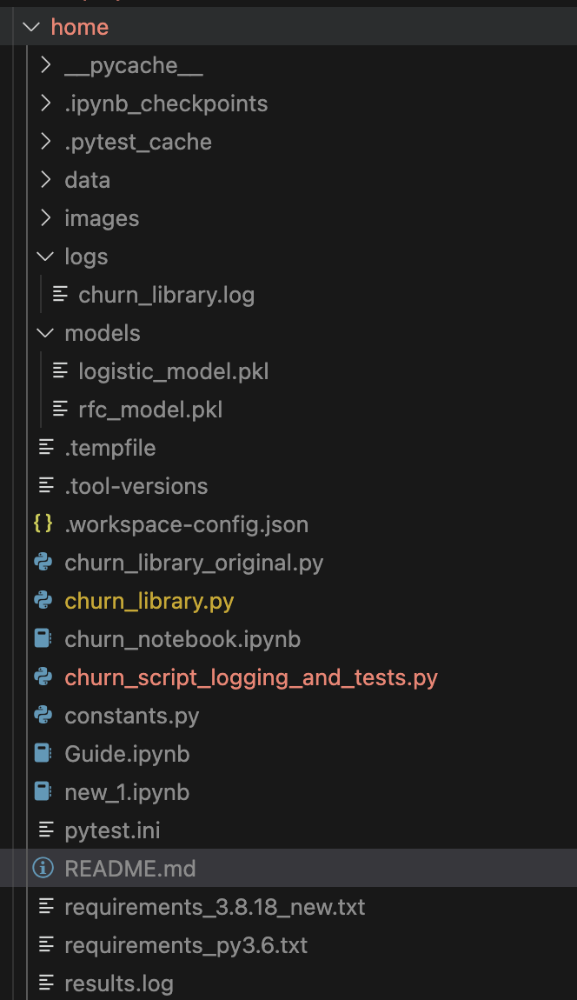

# Predict Customer Churn

This repository contains the project **Predict Customer Churn** for the ML DevOps Engineer Nanodegree by Udacity.

## Author

- Jeremy GU
- 1/25/2024

## Project Description

The **Predict Customer Churn** project is aimed at identifying customers who are likely to stop using a service (churn). The project includes a Python script, `churn_library.py`, which handles various stages of the machine learning pipeline, such as data import, exploratory data analysis (EDA), encoding of categorical features, feature engineering, training machine learning models, and evaluating these models with various metrics and visualizations.

## Files and Data Description

- `churn_library.py`: The main Python script with all functions for data processing, model training, and evaluation.
- `data/bank_data.csv`: The dataset used for analysis.
- `images/`: Directory where generated plots and visualizations are saved.
- `models/`: Directory where trained models are stored.
- `requirements_3.8.18_new.txt`: Contains the list of Python packages required to run the script.
- `pytest.ini`: Configuration file for pytest.
- `churn_script_logging_and_tests.py`: Python script for pytest.
- `results.log`: Logging output from `churn_library.py`.
- `churn_library.log`: Logging output from `churn_script_logging_and_tests.py`.




## System Requirements

- Python 3.10.12
- macOS Sonoma 14.2.1
- Apple M1 Max

## Python Dependencies

All Python package dependencies and their respective versions are listed in `requirements_3.8.18_new.txt`.

## Setting up

Follow these steps to set up and run the project:

```bash
asdf local python 3.10.12
python -m venv .venv
source .venv/bin/activate
pip3 install --upgrade pip
python -m pip install -r requirements_3.8.18_new.txt
python churn_library.py
```

## Running pytest

To run the pytest suite and test the functionality of the script, execute the following command:

```bash
pytest -v churn_script_logging_and_tests.py
```

### Pytest with Logging

For testing with detailed logging, update the `pytest.ini` file as follows:

```ini
[pytest]
log_cli = true
log_cli_level = INFO

log_file = test_pytest.log
log_file_level = DEBUG
log_file_format = %(asctime)s %(levelname)s %(message)s
log_file_date_format = %Y-%m-%d %H:%M:%S
```

After updating `pytest.ini`, run the tests using the same `pytest -v churn_script_logging_and_tests.py` command to get detailed logs.
